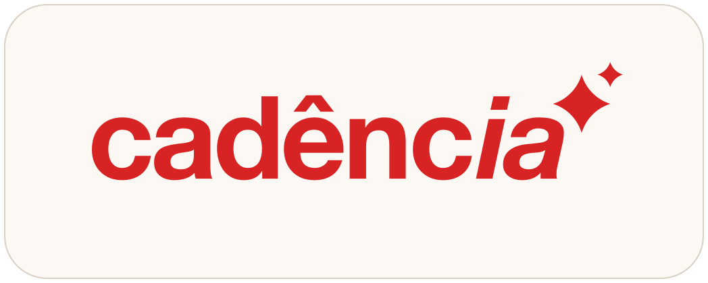

<div align="center">

<picture>
  <source media="(prefers-color-scheme: dark)" srcset=".github/brand/header-dark.svg">
  
</picture>

### Extensão oficial para WordPress

Liga o seu site à [CadêncIA](https://cadencia.soucluster.com.br), a plataforma de conteúdo da [Cluster](https://soucluster.com.br) que planeja, escreve e publica artigos otimizados para busca.

[](https://github.com/clustermarketing/cadencia-plugin/releases/latest)
[](https://wordpress.org/)
[](https://www.php.net/)
[](LICENSE)

[**⬇ Baixar a versão mais recente**](https://github.com/clustermarketing/cadencia-plugin/releases/latest/download/cadencia.zip)

</div>

---

Sozinha, esta extensão não faz nada: ela é a ponte que a plataforma usa para escrever no seu site. Sem uma conta CadêncIA, fica inerte e não acrescenta nada às suas páginas.

## O que ela faz no seu site

- Expõe os campos de SEO do **Rank Math** e do **Yoast** pela API REST, para a plataforma preencher título, descrição e palavra-chave de cada artigo.
- Publica no `<head>` o **JSON-LD** que a plataforma envia (Article, FAQPage, BreadcrumbList), sem despejar JSON no corpo do post.
- Widget opcional **"Resuma este artigo com IA"**.
- **Player de narração** do artigo, opcional.
- Endpoint de **verificação de posse** do site (Search Console e Bing).
- Aplica os **redirects 301** das páginas que a plataforma consolidou, quando duas páginas suas disputavam a mesma busca.

Ela não coleta dados e não chama serviços externos por conta própria: só expõe campos da API REST para a conta CadêncIA autenticada por Application Password.

## Instalação

Baixe o `cadencia.zip` da [release mais recente](https://github.com/clustermarketing/cadencia-plugin/releases/latest) e instale em **Plugins → Adicionar novo → Enviar plugin** no wp-admin. A extensão também está no diretório do WordPress.org.

> [!NOTE]
> **Vindo da versão 1.6.0 ou anterior?** A pasta mudou de `seo-api-bridge` para `cadencia` na 1.7.0. As duas convivem sem quebrar o site, porque os identificadores internos são distintos, e a versão nova desativa a antiga sozinha no primeiro carregamento. Pode remover a antiga pelo wp-admin quando quiser.

## Requisitos

WordPress 5.6+ e PHP 7.4+. A plataforma autentica com uma Application Password de um usuário administrador.

## Desenvolvimento

Arquivo único, sem build e sem dependências: `cadencia.php` é a extensão inteira.

Três regras que não podem ser quebradas ao mexer aqui:

1. **Todo identificador leva o prefixo `cadencia_ext_` / `CADENCIA_EXT_`.** A versão anterior, que ainda pode estar instalada na mesma máquina, declara `cadencia_*` sem prefixo. O WordPress trata pasta diferente como plugin diferente, então as duas carregam juntas, e nomes colidindo é *fatal error* em PHP: site do cliente fora do ar.
2. **Nomes de option e chaves de meta NÃO levam prefixo** (`cadencia_redirects`, `_cadencia_jsonld`, …). É onde os dados vivem: renomear faz a extensão ignorar tudo que a versão anterior gravou.
3. **O código passa pelo Plugin Check do WordPress.org.** Nada de SQL direto, toda superglobal com `wp_unslash` antes de `sanitize_*`, tudo escapado na saída, e strings traduzíveis com o text domain `cadencia`.

Conferir a sintaxe antes de publicar:

```bash
php -l cadencia.php
```

## Publicar uma versão

1. Suba a versão nos dois lugares que precisam bater: o header `Version:` do `cadencia.php` e o `version` do `plugin.manifest.json`. O workflow falha se divergirem da tag.
2. Acrescente a entrada no changelog do `readme.txt` e ajuste o `Stable tag`.
3. Crie a tag e empurre:

   ```bash
   git tag v1.7.0 && git push origin v1.7.0
   ```

   O workflow empacota o `cadencia.zip`, publica a release e move a tag `latest`.

4. No monorepo da CadêncIA, suba a `version` de `frontend/src/lib/wordpress-plugin.manifest.json`. É ela que faz o painel oferecer a atualização ao cliente e montar a URL de download; esquecer este passo deixa quem já atualizou preso em "atualização disponível".

## Licença

[GPLv2 ou posterior](LICENSE), como exige qualquer extensão distribuída para WordPress.

A licença cobre o **código**. "CadêncIA", "Cluster", o logotipo e os personagens da marca não são licenciados por ela: são marcas da Cluster, e usá-las para identificar um produto derivado precisa de autorização. Copiar, modificar e redistribuir o código é livre; passar-se pela CadêncIA não é.
